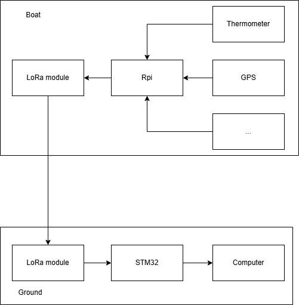
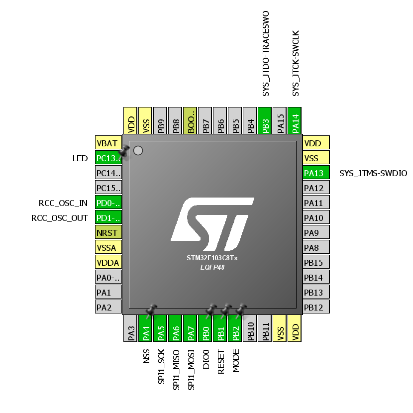
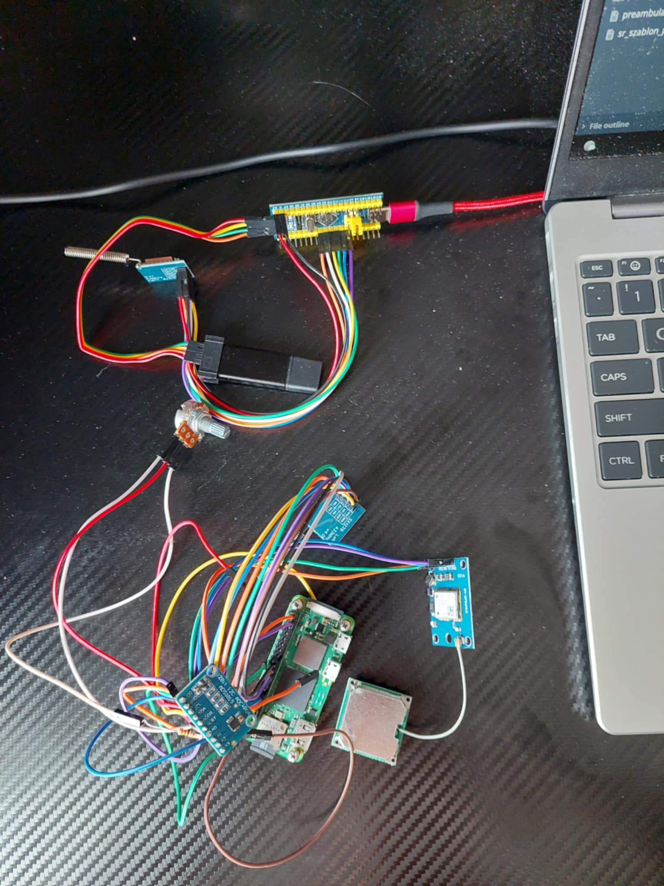
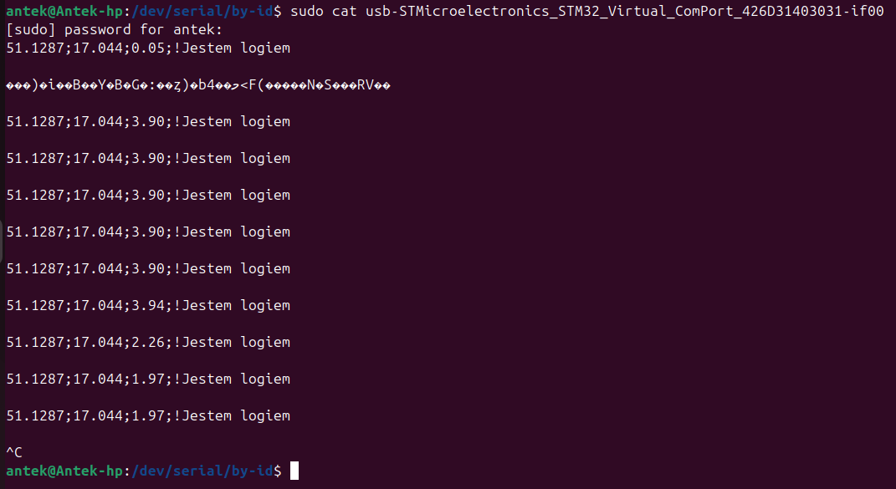

# LoRa Telemetry System - Receiver (STM32) 📡

This repository contains the firmware for the **receiver module** of a telemetry system designed for the autonomous research boat **FOKA**. The system receives sensor data wirelessly via **LoRa (SX1278)** and forwards it to a Ground Control Station (PC) via USB/UART.

The project was developed as part of the *"Robot Drivers"* course at Wrocław University of Science and Technology.


*Fig 1. System architecture diagram: RPi Zero (Transmitter) -> LoRa -> STM32 (Receiver) -> PC.*

## 🎯 Project Overview

The goal of this project is to establish a reliable, long-range wireless link between a floating unit and a ground station.

* **Transmitter (Remote):** Raspberry Pi Zero 2W reading sensors (ADC ADS1015, GPS) and sending data via LoRa.
* **Receiver (This Repo):** **STM32 BluePill (STM32F103C8T6)** receiving LoRa packets and printing them to a serial terminal.

* ## ⚙️ Hardware

* **Microcontroller:** STM32F103C8T6 "BluePill".
* **Communication Module:** LoRa SX1278 (433/868 MHz) operating on SPI.
* **Programmer:** ST-Link v2 (SWD).
* **Connection to PC:** USB (Virtual COM Port) or UART-to-USB adapter.

* ## 🔌 Pin Configuration & Peripherals

The project is generated using **STM32CubeMX**.

* **SPI1:** Communication with SX1278.
    * `NSS` (Chip Select): Managed via GPIO.
    * `DIO0`: External Interrupt (IRQ) for packet reception.
* **USART1 / USB:** Forwarding received data to the PC.
* **LEDs:** Status indicators for RX/TX.


*Fig 2. Pinout configuration from STM32CubeMX.*

## 📡 Communication Protocol

The system uses a custom text-based protocol to maximize flexibility.
Format: `VALUE_1;VALUE_2;...;VALUE_N!LOG_MESSAGE\n`

**Example Frame:**
```text
1.1999;25;HIGH;18.2345;-0.456!I am an important log.
```
## 📂 Project Structure

This repository contains the STM32CubeIDE project:
* `Core/Src/main.c`: Main application logic (LoRa initialization, RX loop).
* `Core/Src/spi.c`: SPI driver configuration.
* `Core/Src/gpio.c`: GPIO settings for LoRa NSS/Reset/DIO0.
* `LoRa_receiver_v2.ioc`: STM32CubeMX configuration file.
* `doc/`: Documentation images.

## 🚀 Getting Started

1.  **Clone the repository:**
    ```bash
    git clone [https://github.com/antpial/LoRaCommunication.git](https://github.com/antpial/LoRaCommunication.git)
    ```
2.  **Import to IDE:** Open the project in **STM32CubeIDE**.
3.  **Build:** Compile the project for the STM32F103 target.
4.  **Flash:** Connect ST-Link v2 and flash the firmware.
5.  **Monitor:** Open a Serial Terminal (e.g., Putty, RealTerm, Serial Monitor) on the COM port to see incoming telemetry.
    * *Baud Rate:* 115200 (or as configured in `main.c`).

## 📸 Gallery


*Fig 3. The complete setup featuring STM32 BluePill and LoRa module.*


*Fig 4. Received telemetry data visible in the serial terminal.*

## 🔗 Related Projects

The complete **FOKA Project** ecosystem consists of three main parts:

1.  👉 **[Onboard Control System (ROS 2 / RPi 4)](https://github.com/antpial/FokaRos2RPi4)**
    * Main boat control system (Hardware drivers & Autopilot).
2.  👉 **[Ground Control Station (GUI / Qt)](https://github.com/antpial/Sensor_Data_Visualisation)**
    * Desktop app for visualizing data received by this STM32 module.
3.  👉 **[Autonomous USV Navigation & Gazebo Simulation](https://github.com/antpial/thesis_USV_gazebo)**
    * Simulation and theoretical analysis (Engineering Thesis).

## 📚 Credits & References

* **Author:** Antoni Piałucha
* **Supervisor:** dr inż. Wojciech Domski
* **Resources:** Based on LoRa library and tutorials from [blog.domski.pl](http://blog.domski.pl).

---
*Project Status: Functional prototype. Data transmission is stable. GPS integration on the transmitter side is in progress.*
